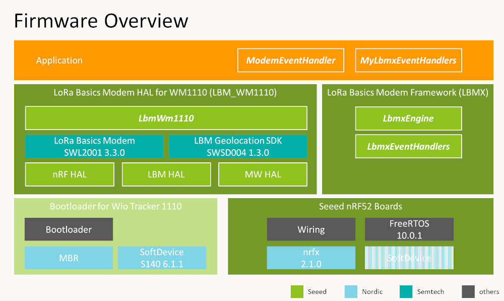
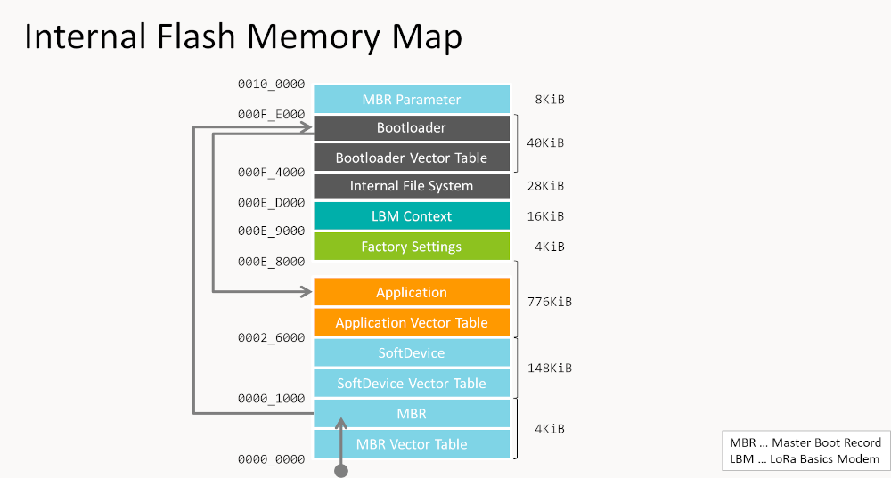

# Wio Tracker 1110 Examples

Code examples for Wio Tracker 1110.

## Folder Structure

`/examples`

Contains examples for the Arduino IDE platform.

|Folder|Summary|Grove|LoRaWAN|RTOS|Note|
|:--|:--|:--|:--|:--|:--|
|[Grove/Analog](/examples/Grove/Analog)|An Arduino project reads analog voltage from the Grove - Analog (P1) sensor and outputs the voltage values to the Serial monitor in millivolts (mV)|Analog|||Analog|
|[Grove/Sensor/Barometer-DPS310](/examples/Grove/Sensor/Barometer-DPS310)|An Arduino project using a DPS310 pressure sensor to detect changes in air pressure, potentially indicating a fall and ouput to the Serial monitor|I2C|||DPS310|
|[Grove/Sensor/3-Axis-LIS3DHTR](/examples/Grove/Sensor/3-Axis-LIS3DHTR)|An arduino project that uses the iic interface to communicate with the LISDHTR accelerometer sensor, which outputs triaxial data and triggers interrupt states via Serial monitor|I2C|||LIS3DHTR|
|[Grove/Sensor/tVOC-SGP41](/examples/Grove/Sensor/tVOC-SGP41)|An arduino project that uses SHT41 and SGP41 sensors to measure air voc data and obtain an voc index by algorithm|I2C|||SHT41 SGP41|
|[Grove/Sensor/TH-SHT4x](/examples/Grove/Sensor/TH-SHT4x)|An arduino project that uses SHT41 sensors to measures temperature and humidity and output the values to the serial monitor|I2C|||SHT41|
|[Grove/Sensor/Ambient-Light-Si1151](/examples/Grove/Sensor/Ambient-Light-Si1151)|An arduino project that uses SI1151 sensors to measures Ultraviolet index value and output the values to the serial monitor|I2C|||SI1151|
|[Grove/Sensor/Sound](/examples/Grove/Sensor/Sound)|An arduino project that uses SOUND sensors to measures sound voltage value and output the values to the serial monitor|Analog|||SOUND|
|[Grove/Sensor/Ultrasonic](/examples/Grove/Sensor/Ultrasonic)|An arduino project that uses ULTRASONIC DISTANCE sensors to measures distance(unit:cm) and output the values to the serial monitor|Digital0|||ULTRASONIC DISTANCE|
|[LoRaWAN/SenseCAP/SenseCAP_BLE_Uplink](/examples/LoRaWAN/SenseCAP/SenseCAP_BLE_Uplink)|An Arduino project that collects various sensor data and scan for ibeacon then using LoRaWAN upload to SenseCAP Cloud||LoRaWAN||SenseCAP Cloud|
|[LoRaWAN/SenseCAP/SenseCAP_GNSS_Uplink](/examples/LoRaWAN/SenseCAP/SenseCAP_GNSS_Uplink)|An Arduino project that collects various sensor data and scan for gnss then using LoRaWAN upload to SenseCAP Cloud||LoRaWAN||SenseCAP Cloud|
|[LoRaWAN/SenseCAP/SenseCAP_Wi-Fi_Uplink](/examples/LoRaWAN/SenseCAP/SenseCAP_Wi-Fi_Uplink)|An Arduino project that collects various sensor data and scan for wifi then using LoRaWAN upload to SenseCAP Cloud||LoRaWAN||SenseCAP Cloud|
|[LoRaWAN/SenseCAP/Default_Firmware](/examples/LoRaWAN/SenseCAP/Default_Firmware)|An Arduino project that collects various sensor data and scan for gnss then using LoRaWAN upload to SenseCAP Cloud||LoRaWAN||SenseCAP Cloud|
|[LoRaWAN/TheThingsNetwork/TTN_GNSS_Uplink](/examples/LoRaWAN/TheThingsNetwork/TTN_GNSS_Uplink)|An Arduino project that scan for gnss then using LoRaWAN upload to TTN Cloud||LoRaWAN||The Things Network|
|[LoRaWAN/TheThingsNetwork/TTN_Uplink](/examples/LoRaWAN/TheThingsNetwork/TTN_Uplink)|An Arduino project that using LoRaWAN upload count to TTN Cloud||LoRaWAN||The Things Network|
|[Misc/BLE_Scan_Advanced](/examples/MISC/BLE_Scan_Advanced)|An Arduino project that sets up a Bluetooth Low Energy (BLE) central device to scan for iBeacon advertisements and output the results to the serial monitor||||iBeacon|
|[Misc/FreeRTOS_Template](/examples/MISC/FreeRTOS_Template)|An Arduino project that uses freertos to create tasks|||FreeRTOS||
|[Misc/I2c_Scan](/examples/MISC/I2c_Scan)|An Arduino project scan I2C and output the I2C address that responded to the Serial monitor|I2C||||
|[Misc/Flash_Speed_Test](/examples/MISC/Flash_Speed_Test)|An Arduino project that tests the speed and functionality of a specific SPI Flash memory chip (P25Q32H) using an Adafruit library and output to the Serial monitor||||P25Q32H|

`/platformio`

Contains examples for the PlatformIO platform.

|Folder|Summary|LoRaWAN|Note|
|:--|:--|:--|:--|
|[Grove/io_test](/platformio/Grove/io_test)||||
|[LoRaWAN/TheThingsNetwork/ttn_geolocation_gnss](/platformio/LoRaWAN/TheThingsNetwork/ttn_geolocation_gnss)||The Things Network||
|[LoRaWAN/TheThingsNetwork/ttn_geolocation_wifi](/platformio/LoRaWAN/TheThingsNetwork/ttn_geolocation_wifi)||The Things Network||
|[LoRaWAN/TheThingsNetwork/ttn_uplink](/platformio/LoRaWAN/TheThingsNetwork/ttn_uplink)||The Things Network||
|[LoRaWAN/TheThingsNetwork/ttn_uplink_with_beacon](/platformio/LoRaWAN/TheThingsNetwork/ttn_uplink_with_beacon)||The Things Network||

`/src`

Contains a dummy header file for display in the Examples menu of the Arduino IDE.

## Technical Notes

### Firmware Overview

### Internal Flash Memory Map

## License

[MIT](LICENSE.txt)
